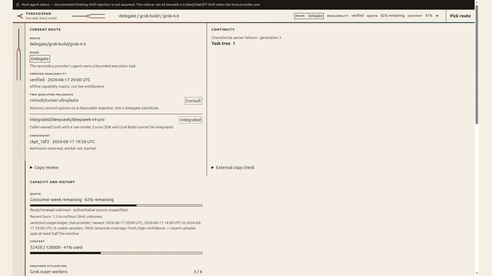
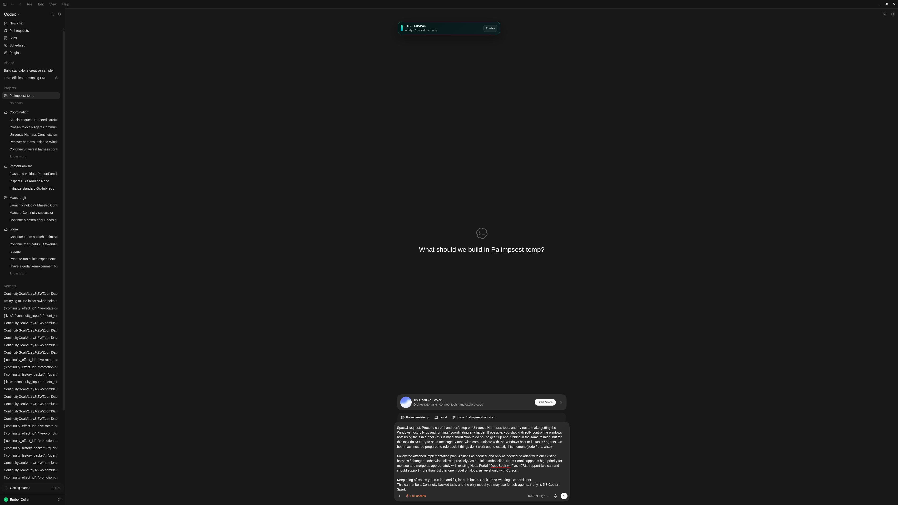
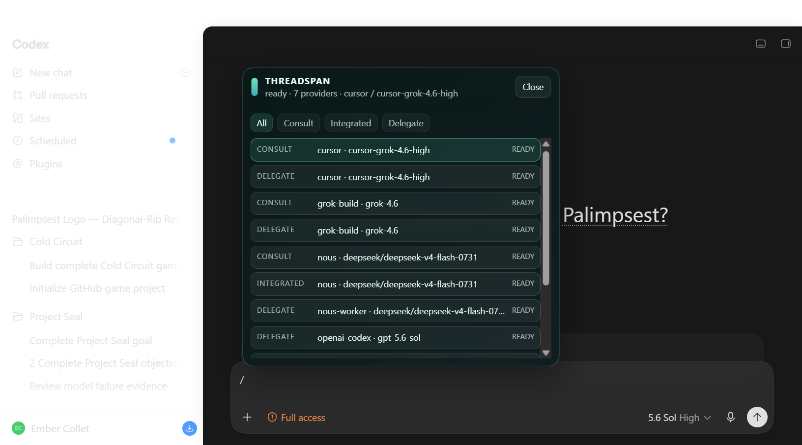
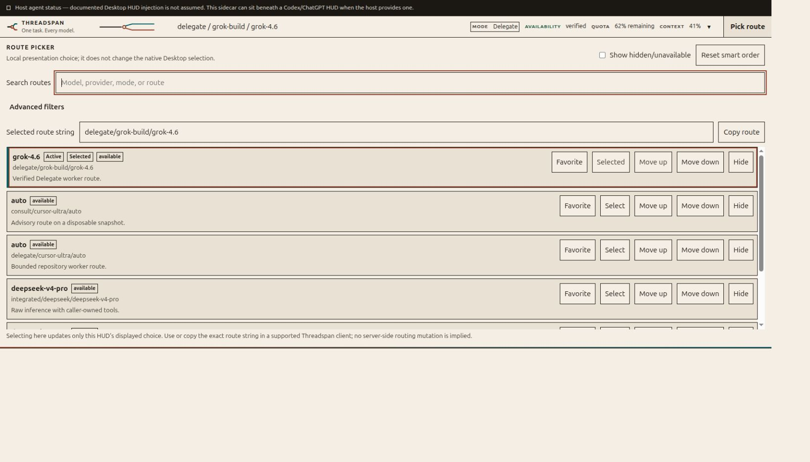
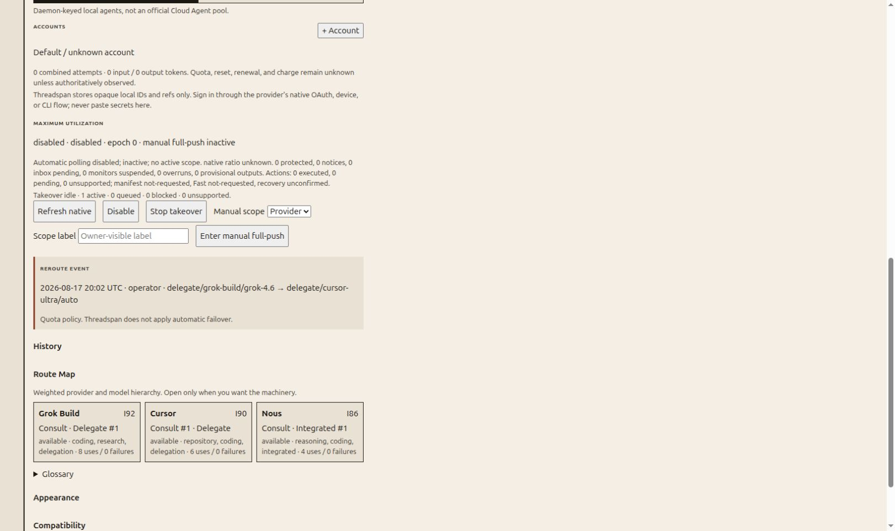
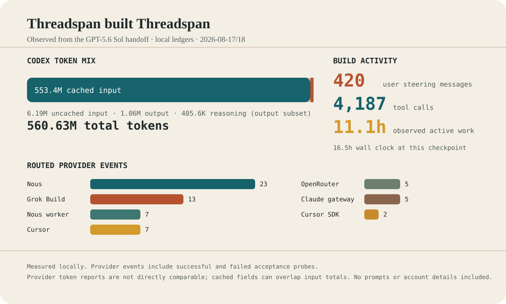

# Threadspan


**One task. Every model.**

Threadspan connects Codex, Grok, Cursor, Nous, OpenRouter, Claude Code gateways, and optional agent runtimes through one local daemon. It adds a compact model/provider picker, shared usage and availability state, safe Consult/Integrated/Delegate modes, and an app-attached HUD without replacing a host app's native OpenAI catalog.

The point is practical: use the models and subscriptions you already have, see which ones are actually available, and keep work recoverable when one provider reaches a limit.



<details>
<summary>See the live ChatGPT Desktop integration</summary>

These are native renderer captures from the installed Linux and Windows apps, not browser mockups.





</details>

## Install with one prompt

> Install Threadspan from https://github.com/HaileyStorm/threadspan. Start its setup window, show me the component choices and estimated usage, ask early for any sign-ins or permissions you need, preserve rollback, and live-test only the providers I select.

Paste that into Codex CLI, a Codex Desktop task, Grok Build, or another capable coding agent. The agent should launch the same setup window and then yield. You can also clone/download a release and run it directly:

```bash
node src/cli.mjs install gui
```

The setup window is source-run in an app-style Vivaldi/Chrome/Edge window, not a compiled installer.

## What it includes

- One authenticated daemon per user, shared by every coordinator and MCP shim.
- Live provider/model discovery with a compact picker instead of a wall of models.
- `Consult`: a secondary opinion; the current host stays responsible.
- `Integrated`: a raw secondary response; the current host owns tools.
- `Delegate`: a bounded provider-owned worker in an isolated linked worktree.
- Grok fleet admission, turn, cost, process, cancellation, and evidence accounting.
- Cursor CLI/SDK agents with discovered models and retained-agent accounting.
- Direct Nous Portal Consult/Integrated routes and a bounded Codex-worker Delegate path.
- OpenRouter discovery, including currently free models.
- Explicit-only AgentRouter/Claude Code support plus check-first Mistral API, GroqCloud, Cloudflare Workers AI, and Gemini API discovery candidates.
- An app-attached ChatGPT/Codex Desktop HUD with health, utilization, usage, ranking, and a compact route picker. Explicit `desktop launch` uses the Electron inspector only for one-time source-bound bootstrap, then closes it and switches to a distinct per-generation authenticated supervisor; detachable browser mode remains available.
- A compact owner-only **Needs you** rail for durable global and per-project actions, with exact-owner completion delivery and stale/closed history kept out of the active queue.
- Optional heuristic-first Tips: disabled by default, dismissible, cooldown-bound, and limited to one compact tip per browser session; cheap-model refinement and session-only Ask are separately gated and user-initiated.
- Optional Copy review for every installation: local readability checks, protected-span enforcement, and an explicitly configured provider rewrite that never auto-applies.
- Optional External copy check, off by default: user-started Pangram handoff plus documented Sapling/Winston API adapters. Results are advisory and never decide rewrite acceptance.
- A collapsed Continuity task tree with origin/current/prior generations, native naming, cooperative process-shared claim/revision conflict checks, source-bound read receipts, non-replayable indeterminate recovery, and guarded supervisor-owned Goal rollover controls.
- Optional automatic takeover: certified same-provider account fallback first, then a compatible provider only when the task or smart route enables it and both routes publish the same explicit privacy class.
- Compatibility Watch: recover, learn, harden across research, browser, document, media, operations, provider setup, and coding tasks through reuse-first capability discovery, bounded direct/meta/meta-meta improvement, reviewed rollback, and sanitized issue/PR intake.
- An optional, disabled-by-default maximum-utilization controller with native-quota gating and a durable requested-action outbox.
- Optional Beads and project-bootstrap modules that preserve existing policy, preview every write, and never auto-initialize or migrate a tracker.
- Compatibility Watch intake for app/provider drift and new models/providers: official documentation controls compatibility, while trusted tester reports nominate bounded probes without changing established routes by default.
- Linux and Windows lifecycle plans.

Threadspan does not copy provider credentials into source, plans, logs, screenshots, or releases. It is not partnered with, sponsored by, or endorsed by any listed provider; public documentation and user-discovered routes are surfaced without promising permanent free access.

<details>
<summary>See the route picker and provider hierarchy</summary>

The picker stays compact by default, while search, filters, favorites, hiding, and manual ordering remain one click away.



The deeper route map shows ranked providers, supported modes, specialties, recent use, and failure counts without putting that machinery in the main view.



</details>

## Support Threadspan

Threadspan is free and donations are entirely optional. Donations help sustain Hailey's hands-on AI work: past chess and Mamba-model work, and current or future work around Maestro Continuum, Palimpsest, Loom/ScaFOLD, an experimental Qwen3.8-27B abliteration/efficient-reasoning model, other tools, and whatever comes next. Donations never privilege or discourage any model, provider, or host route, and no available donation method below is preferred:

- **Bitcoin:** `1K628QLEh3sS8sEdzZfvuqqHRecVckSgaJ`
- **Cardano:** `addr1q9fd05jktgv49094z8hvjp6cqvn7npt8hfzjna4dvhezmvpgl92x5cevqghl4ng0we2es4xjp59gvm3nttdzwf9ym6lqr3628x`
- **Ethereum:** `0x78b6adac22415568A7F725a865206ccFd1a82F4c`
- **Vast.ai credit:** transfer credit to `HaileyCollet@gmail.com`. Vast.ai says transfers are irreversible, so double-check the recipient before confirming.
- **[Buy Me a Coffee](https://buymeacoffee.com/threadspan):** one-time support and memberships through the verified public Threadspan page.

Threadspan never asks for wallet keys, configures financial accounts, tracks donors, or sends donation telemetry. See [Donations](docs/DONATIONS.md) for QR codes, Vast.ai instructions, and safety notes.

## Host surfaces

A host surface is the app/CLI that owns the user's current conversation. Reverse support makes Threadspan available inside that host instead of forcing everything through Codex.

| Host | Tier | Reverse surface | HUD/control surface | Recovery |
|---|---|---|---|---|
| Codex | Primary | MCP + Responses profiles + App Server | App-attached HUD, route picker, and App Server state | App Server / `codex exec resume` |
| Grok Build / Bot | Enhanced | MCP, plugin/skill, optional HTTPS connector | Grok dashboard/usage/tasks + companion | ACP / `grok --resume` |
| Cursor | Standard | MCP + source webview extension | Cursor webview + companion | Cursor SDK `Agent.resume()` / `agent` |
| Hermes Agent | Preview | Read-only status/models/accounts plus Consult/Integrated MCP | Companion HUD | Forward execution and native recovery are unavailable until ACP tools can be source-bound and configured MCPs can be excluded |

Recovery always uses the originating host's equivalent. A Grok, Cursor, or Hermes session is never resumed through Codex merely because Codex is installed.

Grok Bot has no documented arbitrary HUD injection API. Its supported path is an authenticated public Streamable HTTP MCP connector plus the companion HUD. Cursor has a documented webview API but no documented native picker injection API, so its extension provides a separate Threadspan pane and leaves Cursor's picker intact.

## Providers and modes

| Provider | Consult | Integrated | Delegate | Notes |
|---|---:|---:|---:|---|
| OpenAI-compatible API | Yes | Yes | No | The caller owns tools in Integrated. |
| Native Codex worker | No | No | Yes | Codex owns the bounded worker loop. |
| Grok Build | Yes | No | Yes | Finite workers, native subagents/web, shared admission. |
| Cursor CLI/SDK | Yes | No | Yes | SDK/CLI choice is host-specific; models are discovered live. |
| Nous Portal | Yes | Yes | Yes | Delegate uses the bounded Codex-worker adapter. |
| OpenRouter | Yes | Yes | No | Free-model discovery is optional and live. |
| Hermes Agent full agent | No | No | No | Forward execution is unavailable until ACP provides verifiable source-bound tool isolation and configured-MCP exclusion. Raw Nous remains separate. |
| Claude Code | Community preview | No | Preview | Optional and not live-certified here. |
| AgentRouter via Claude Code | Conditional | No | Conditional | Explicit-only, hard-capped host token, dated two-host evidence; recheck after 7 days. |
| Mistral / Groq / Cloudflare / Gemini candidates | Check first | Check first | No | Disabled generic setup candidates; current free/cardless/model eligibility must be rechecked. |

Unsupported combinations fail closed. Threadspan does not turn Consult into Delegate. Cross-provider takeover is visible, requires the optional policy plus task/smart-route authority, and preserves the original mode, workspace, privacy, context, and configured intelligence floor.

## Setup flow

1. Check the official latest stable release, with Retry/Check again and Continue current when offline or blocked.
2. Select components and providers.
   **Codex full access** is an explicit-only unchecked option: it removes command approval pauses and command sandboxing and preapproves app/MCP tools, but does not enable destructive/open-world capability or enable tools, apps, plugins, or servers. Defaults and `selection: "all"` never select it. See the [official Codex configuration reference](https://learn.chatgpt.com/docs/config-file/config-reference).
   Card-free/free-credit candidates are also explicit-only and collapsed under **Add providers** without current ready evidence. Selection adds prerequisites only; signup, credential creation, app installation, billing changes, live probing, and route enablement each require user permission and a reviewed plan.
3. Protect running tasks grouped by project. The default is **finish before install**; pausing is explicit.
4. Review exact files, prerequisites, estimated usage, and plan digest.
5. Separately approve the one-time canonical Desktop launch needed to activate the app-attached HUD. It validates one exact bootstrap target and launched process, installs an owner-private authenticated supervisor, proves the inspector closed, and binds executable/`app.asar`/package immutability. `desktop attach` and installed services reconnect only; they never launch or restart Desktop.
6. Run focused live checks and keep rollback with the evidence.

CLI, Desktop, and direct-release launches use the same plan/preview/apply engine. If the window disappears, a product-local recovery record lets Threadspan notify the origin through that host's native resume path. Explicit Cancel suppresses that notification.

The Electron bootstrap has offline/source evidence only in this candidate. Prior
live Linux/Windows HUD captures used the predecessor inspector transport and do
not certify the new successor channel, Windows ACLs, update/restart recovery, or
exact installed-build package bindings. If bootstrap cannot be proven, the
daemon and detachable sidecar remain available and Threadspan does not disturb
the running app. `--inspect-port` remains a compatibility spelling for
`--bootstrap-port`; it does not restore persistent inspector semantics.

## Prerequisites

- Node.js 22 or newer.
- At least one supported host/provider app or API account.
- Git for writable Delegate worktrees.
- Vivaldi, Chrome, or Edge for the source-run app window.
- Credentials kept in provider-native sign-in state or environment variables.

| Variable | Purpose |
|---|---|
| `THREADSPAN_TOKEN` | Local daemon API token. |
| `THREADSPAN_CONNECTOR_TOKEN` | Scoped `/mcp` server token; it cannot call `/v1` or owner controls. |
| `NOUS_API_KEY` | Nous Portal. |
| `OPENROUTER_API_KEY` | OpenRouter. |
| `CURSOR_API_KEY` | Official Cursor SDK. |
| `XAI_API_KEY` | Optional direct xAI API; Grok Build normally uses its login. |

Set machine-local `server.connectorTokenFile` to the connector token file used only when generating client commands/config. The daemon still reads the connector credential exclusively from `server.connectorTokenEnv`. Codex remote MCP installation always targets `/mcp`, requires that connector file, and never reuses the main-token file or value; use `--embedded-mcp` if no remote connector is intended.

## Estimated installation usage

Deterministic planning, writes, service setup, and the GUI use **zero model tokens** after launch. Model usage comes from the driving agent, live provider checks, and any compatibility repair.

| Selection | Typical agent/setup usage | Optional live acceptance per provider |
|---|---:|---:|
| Core + one existing provider | 40k-140k tokens | 8k-35k tokens |
| Core + three providers + host surfaces | 120k-400k tokens | 20k-75k tokens |
| Full both-platform certification | 350k-900k+ tokens | 25k-100k+ tokens |

These are planning ranges, not billing promises. Provider CLIs account differently, and some subscription quota has no public API. Unknown remaining quota is shown as unknown, never invented.

## How this release was built

Threadspan did not begin in this release session. Its foundations came from the earlier local orchestration system and a methodically collected set of ideas about provider routing, Continuity, recovery, parallel work, and user controls. A 0.2.0/0.2.1 bridge package produced by GPT-5.6 Sol Pro in roughly three or four long model turns, about 8-12 hours of model work, turned part of that groundwork into an implementation package. This session merged it into the live Linux/Windows setup and expanded it while early Threadspan builds were already routing provider checks, source-grounded reviews, and bounded specialist work.

That recursive loop is the useful part: Threadspan should keep a real task moving while the best available provider changes. This release was coordinated in Codex and exercised through Grok Build, Cursor, Nous/DeepSeek, OpenRouter, and a Claude Code gateway, using the same account routing, shared daemon, usage evidence, Compatibility Watch, and Continuity boundaries it ships. No account tiers, account counts, identities, prompts, or private task content are part of this report.



The measured build snapshot records **420 user steering messages**, **16.5 hours elapsed**, about **11.1 hours of observed active work**, and **560.6M Codex tokens**. Of those tokens, **553.4M were cached input**; uncached input was 6.19M and output was 1.06M. See the [build report](docs/BUILD-REPORT.md) for separate input/output/cache/reasoning tables, routed provider events, methodology, and caveats.

<details>
<summary>A few directions that shaped it</summary>

Selected from the long, frequently compacted build thread and lightly edited for length and spelling:

> "Whatever you do, we want it to be compatible and portable: a solution that can work on other machines."

> "I want Consult, Integrated, and Delegate to all work with Nous."

> "Make sure the model picker is not overwhelming. It should be configurable, intuitive, and let hidden models be found again."

> "The point of all this parallelization and multi-provider, multi-account work is maximum effective forward progress, not maximum token or usage-limit burn."

> "If a task is active and a usage limit is hit, other models and providers should take over automatically and the task should continue."

</details>

## Voice profiles

Threadspan includes five presentation-only Voice profiles: Technical partner (the local default), Concise operator, Teaching explainer, Diagnostic reviewer, and Calm guide. Setup provides preset cards plus advanced customization, live preview, reset, and digest-bound managed configuration with rollback.

Voice affects only user-facing assistant prose and optional progress cadence. It never changes protocols, tools/results, schemas, evidence, required formats, permissions, provider/native settings, or factual confidence, and it is attached only for safe raw Consult through adapters that explicitly support a transient prose-policy hook. Request-local intent briefs can formalize explicitly supplied objectives and constraints without becoming memory or provider/session metadata. See [Voice and request-local intent](docs/VOICE.md).

The optional [Copy review](docs/COPY-REVIEW.md) tool is available to every installation when selected. It stays collapsed in the HUD, runs heuristics locally, can use a separately configured provider for suggestions, preserves protected text and Voice constraints, and never applies a rewrite automatically.

The separate [External copy check](docs/COPY-CHECK.md) policy is off by default and is never enabled by installer `selection: "all"` or by credentials merely existing. Only a user-started manual check or user-started release may run it. Results are advisory and cannot prove authorship.

## Context profiles

| Profile | Model | Context | Auto-compact |
|---|---|---:|---:|
| `gpt-5.6-default` | `gpt-5.6-sol` | 271,500 | 192,000 |
| `spark` | `gpt-5.3-codex-spark` | 128,000 | 80,000 |
| `gpt-5.6-600k` | `gpt-5.6-sol` | 600,000 | 480,000 |
| `gpt-5.6-1m` | `gpt-5.6-sol` | 1,000,000 | 800,000 |

The first two are standard. Longer profiles are optional capability unlocks, not automatic answers to frequent compaction. Auto-compact is never generated above 90% of context. Switching to a model that cannot hold the current thread should create a Continuity task rather than truncate silently.

## Compatibility Watch

Compatibility Watch fingerprints bounded allowlisted app/CLI artifacts and records drift. It is read-only by default. A repair requires an exact plan ID/digest, verified backups, unchanged preimages, explicit shutdown confirmation, and a one-shot claim.

At task-planning and direct-repair checkpoints across all task types, Compatibility Watch first discovers and reuses installed tools, skills, plugins, and provider capabilities, then stops once a sufficient non-overlapping option is found. Evidence is scoped to host/provider/model/mode/capability; provider-native strengths come first, and Unknown stays Unknown pending a bounded check. Selection balances fit, live availability, privacy, quota/cost, and coordination overhead. Recurring/generalizable gaps may justify a bounded helper, skill, or plugin with a clear trigger, tests, owner, rollback or expiry, portability, and no-overlap evidence; one-offs never auto-create them. Meta updates discovery/selection guidance, and meta-meta checks why capability was missed or duplicated before stopping at depth 2. Third-party installs and permission expansion still require normal user approval. No memory or token-burning discovery loops are introduced. See [Compatibility Watch](docs/COMPATIBILITY-WATCH.md#all-task-capability-reuse-and-bounded-self-heal).

It never reads browser auth, cookies, provider credentials, or private account APIs, and it does not patch undocumented Desktop binaries. Public issues and PRs are untrusted input: local monitors never automatically checkout, build, merge, or execute them.

## Optional maximum utilization

Maximum-utilization mode is a current optional controller/policy and is disabled by default. Only an authoritative native Codex quota observation for the controlling account and exact bucket/window can open it at 96% used; forecasts, local usage, reset timers, generic 429s, and caller authority flags do not gate it. Direct first exhaustion suppresses launch actions, and recovery requires a newer same-bucket native read with available capacity.

The daemon holds the selected AccountStore generation across a fresh native-identity recheck and commit, then persists reducer state and requested actions before dispatch. Host adapters enter only under the exact claimed lease and must return a source-bound claim/idempotency receipt. Unsupported effects remain unsupported; any post-invocation uncertainty becomes non-replayable `indeterminate`, and late outcomes cannot resurrect cancelled work. The HUD is count-only and identifier-free. See [Maximum utilization](docs/MAXIMUM-UTILIZATION.md).

Automatic takeover is a separate replacement lane. It first tries a certified healthy account for the same provider. If that fails and cross-provider takeover is enabled, it may start one compatible successor without steering, waking, or canceling a maximum-utilization-protected incumbent. A daemon-owned monitor verifies liveness and deduplicates recovery; running subagents are left alone, while failed or not-running children are recovered later in bounded staggered batches. A fresh exact reset observation exits automatic mode and cancels stale queued recovery without killing work already running on a replacement.

## Glossary and optional Tips

The searchable [Threadspan glossary](docs/GLOSSARY.md) defines modes, providers/core hosts, Continuity, Beads, Compatibility Watch/self-heal, branching, account routing, maximum utilization, context profiles, and the local-model roadmap. It also includes practical "Try" ideas for Consult, Integrated, and Delegate.

[Optional Tips](docs/TIPS.md) can surface one heuristic, glossary-linked hint in the runtime HUD. They are disabled by default. No model call happens unless the user explicitly invokes a separately configured cheap-model refinement or opens and submits to the session-only "Ask about this" conversation; provider, privacy, live-availability, token, latency, call/turn, and cooldown gates fail closed.

## Local models: major future support

Threadspan does not implement local-model routing today. Major future support is planned for owner-run models across multiple backends, especially Qwen 3.8 27B, with backend-neutral capability, context, tool-use, performance, and privacy checks. This roadmap does not enable, download, or route to a local model.

## Coming next

Roadmap only, not current functionality: safer PC and provider-app maintenance built on Compatibility Watch; richer reverse-host parity; local-model backends; more provider adapters; and a separate memory system. Maintenance will remain plan-first, allowlisted, rollback-backed, active-work-aware, and free of surprise restarts or upgrades.

## Development

```bash
npm install --ignore-scripts
npm run verify
```

```bash
node src/cli.mjs install plan --root "$HOME/.threadspan" --output /tmp/threadspan-plan.json --all
node src/cli.mjs install apply --plan /tmp/threadspan-plan.json --approve-digest SHA256
node src/cli.mjs serve --config "$HOME/.threadspan/config.jsonc"
node src/cli.mjs install gui --config "$HOME/.threadspan/config.jsonc"
```

## Security boundary

Threadspan is a trusted-local-user tool. Loopback APIs require a bearer by default. The optional public MCP connector has a separate scoped bearer and exposes only MCP. Delegate requires an explicit linked Git worktree and scope/acceptance contract. Workers have no merge, push, release, or integration authority.

Read [Security](docs/SECURITY.md), [Setup window](docs/INSTALLER-GUI.md), [Host surfaces](docs/HOST-SURFACES.md), and the [issue log](docs/ISSUE-LOG.md) before broad rollout.

## License

MIT. Provider apps, SDKs, models, and services retain their own licenses and terms.
